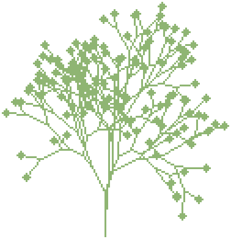

# Pollen

<p align="center"></p>

Your coding agents' work, drawn as a garden in a shared [Tonk](https://tonk.network)
space: every file an agent edits becomes a plant, and each agent walks the
garden as a figure. This repo is the hook that reports the work.

**Experimental software:** expect rough edges and changes between versions.

**Claude Code** works; **Codex CLI** and **OpenCode** are planned ([tools/phase0](tools/phase0)).
macOS and Linux, Python 3.8+, standard library only.

## Install

You need the `tonk` CLI, signed in, with the garden's space joined
(`tonk join <invite-url> --name <space>`). Git is optional.

```sh
git clone --depth 1 https://github.com/plsdlr/pollen-connector-tonk ~/.local/share/tonk-pollen/app
python3 ~/.local/share/tonk-pollen/app/pollen.py setup --space <space>
```

Then, in each project you want in the garden:

```sh
cd <project>
python3 ~/.local/share/tonk-pollen/app/pollen.py enable   # hooks in .claude/settings.local.json
python3 ~/.local/share/tonk-pollen/app/pollen.py status   # "ready", plus the garden's URL
```

Or paste this to Claude Code:

> Install Pollen from https://github.com/plsdlr/pollen-connector-tonk for
> the Tonk space `<space>` following its README, enable it in this project,
> and show me the output of `pollen.py status`.

## What gets shared

For each file an agent changes in an enabled project: the repo's name or git
remote, the file's path, and how often it changed. For each session: its
folder name and activity. Never file contents or prompts. Tonk keeps
history, so only enable projects you're fine sharing with the space.

## Commands

`setup --space NAME` · `enable [DIR]` · `disable [DIR]` · `status [DIR]` ·
`hook claude` (run by the hooks, not by hand)

MIT licensed, see [LICENSE](LICENSE).
